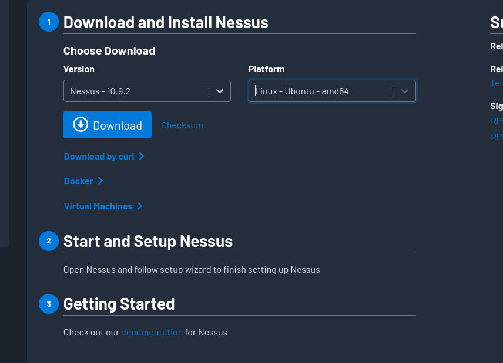
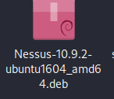
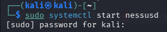
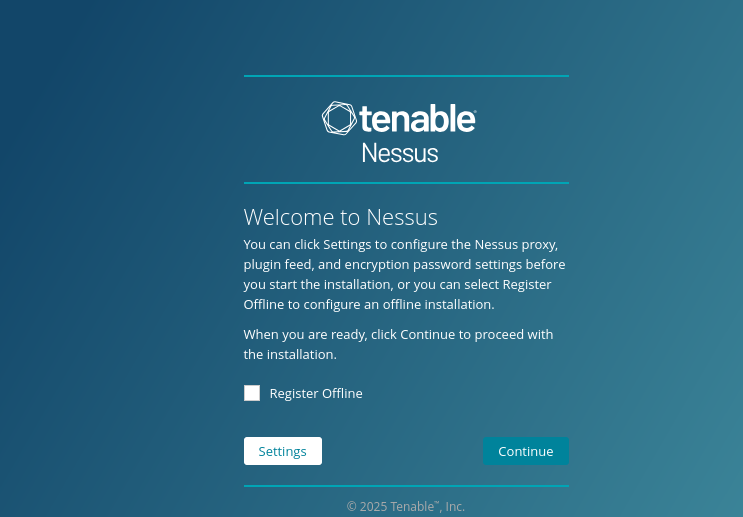

# Internship-Elevatelabs-task3

## Task 3  : Perform a Basic Vulnerability Scan on Your PC.

### Objective: 

Use free tools to identify common vulnerabilities on your computer.

### Tools:  

OpenVAS Community Edition (free vulnerability scanner) or Nessus Essentials.
 
### Deliverables: 

Vulnerability scan report with identified issues

### Solution :

#### Step 1 :- Install Nessus Essentials for kali linux

from website https://docs.tenable.com/nessus/Content/InstallNessus.htm

After downloading Nessus from the website we get a folder in download option

Open terminal in downloads to install use command

sudo dpkg -i Nessus-10.9.2-ubuntu1604_amd64.deb

sudo apt --fix-broken install -y

Then start the service:

sudo systemctl start nessusd

And open in browser https://127.0.0.1:8834

Click "Continue".

On the next page, choose "Nessus Essentials" (the free version).

Enter name, email, and click Register — we get an activation code in your email.

Paste that activation code into the setup.

Create a username and password for logging in.

Nessus will then download plugins — this can take 1 hour.

Once it finishes, log in with username and password.

#### Step 2 :-
